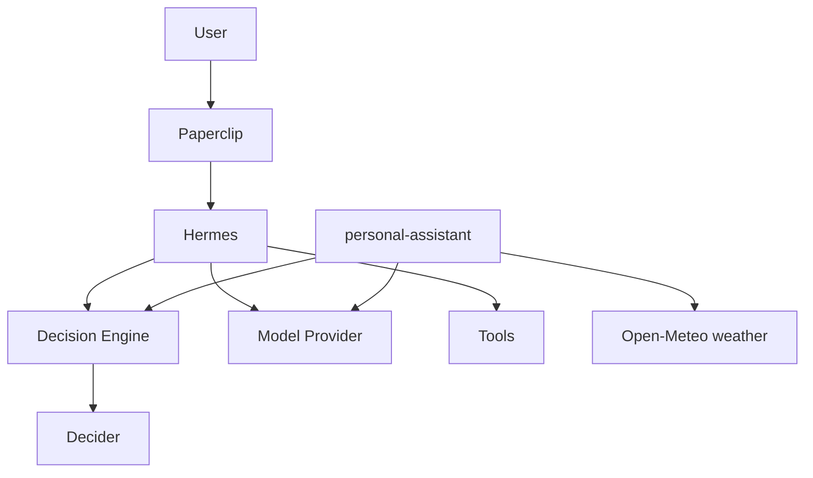

# Helm

Self-hosted platform for AI agents. First useful agent: a **Personal Assistant** that can generate a daily briefing (calendar, weather, news, fitness, priorities). The same stack is meant to grow into specialized agents for professional workflows, document analysis, and software projects.

**Priorities:** working system > theory · simple > clever · self-hosted > managed · replaceable > coupled · cheap/free > expensive.

## Architecture overview



| Component | Role |
|-----------|------|
| [Paperclip](https://github.com/paperclipai/paperclip) | Control plane / orchestration |
| [Hermes Agent](https://github.com/NousResearch/hermes-agent) | Agent runtime (gateway mode) |
| [Decider](https://github.com/Mapika/decider) | Typed structured decisions (not a generative LLM) |
| `decision-gateway` | `DecisionEngine` adapter over Decider |
| `model-router` | Minimal `ModelProvider` (stub or OpenAI-compatible) |
| `personal-assistant` | `generate-daily-brief` orchestration + weather tool |

Details: [docs/architecture.md](docs/architecture.md) · local workflow: [docs/development.md](docs/development.md) · VPS: [docs/deployment.md](docs/deployment.md).

## Prerequisites

- Docker Engine + Docker Compose v2
- ~16 GB RAM recommended when running Decider-2B on CPU
- `bash`, `curl`, `openssl`

## Setup

```bash
./scripts/bootstrap.sh   # creates .env + data dirs + Hermes seed config
```

## Environment variables

Copy from `.env.example`. Required before `compose up`:

| Variable | Purpose |
|----------|---------|
| `BETTER_AUTH_SECRET` | Paperclip session signing (`openssl rand -hex 32`) |
| `HERMES_API_SERVER_KEY` | Hermes OpenAI-compatible API auth (≥8 chars) |
| `PAPERCLIP_DEPLOYMENT_MODE` | `authenticated` for Docker (`local_trusted` is loopback-only) |
| `PAPERCLIP_BIND` | `lan` so the container can listen on `0.0.0.0` |
| `PAPERCLIP_ALLOWED_HOSTNAMES` | Docker DNS hosts Paperclip accepts (default `paperclip,localhost,127.0.0.1`) |

Optional: `OPENAI_API_KEY`, `ANTHROPIC_API_KEY`, `DECIDER_MODEL`, `DECIDER_DEVICE`, ports — see `.env.example`.

`personal-assistant` reads **`WEATHER_LOCATIONS`** (semicolon-separated `name:lat,lon` entries). Default: Barcelona and Sant Cugat del Vallès — same string in `compose.yaml`, `.env.example`, and the service fallback. The daily brief exposes `sections.weather.locations[]` with **now / rest-of-today / tomorrow** per place (Open-Meteo, `Europe/Madrid`) and one shared `sections.weather.narrative`.

Optional **Google Calendar** OAuth in root `.env` fills `sections.agenda` (today + tomorrow, Madrid). Without creds the brief returns `sections.agenda_status: "unconfigured"` and still succeeds. Setup: [docs/google-calendar-agenda.md](docs/google-calendar-agenda.md).

## Starting / stopping

```bash
docker compose up -d
docker compose down
```

## Logs

```bash
docker compose logs -f
docker compose logs -f paperclip hermes decider decision-gateway
```

## Health checks

```bash
./scripts/healthcheck.sh
```

Expected:

```
Paperclip       OK
Hermes          OK
Decider         OK
Decision API    OK
Model API       OK
Personal Asst   OK
```

## Daily brief

Scheduled via Paperclip Routine **Daily brief** at `0 7 * * *` (`Europe/Madrid`), assigned to Hermes Runtime. Hermes calls `personal-assistant:8083/v1/generate-daily-brief`, comments the result, sends the same summary to your Telegram DM (when paired), and marks the issue done. Operator setup (BotFather, allowlist, home channel): [docs/telegram-daily-brief.md](docs/telegram-daily-brief.md).

```bash
# Create/update the routine + cron trigger (idempotent)
./scripts/ensure-daily-brief-routine.sh

# Manual fire (smoke / catch-up)
./scripts/run-daily-brief-routine.sh

# Host-side brief without Paperclip
./scripts/generate-daily-brief.sh
```

Pause or edit the schedule in Paperclip → Routines. Hermes needs `approvals.mode: off` (unattended curl) and `PAPERCLIP_API_KEY` in `data/hermes/.env` (mint with `./scripts/ensure-hermes-paperclip-key.sh`). Paperclip must allow Docker DNS hosts via `PAPERCLIP_ALLOWED_HOSTNAMES=paperclip,localhost,127.0.0.1`. Uses Decider for routing, Open-Meteo day-ahead weather per `WEATHER_LOCATIONS`, mocked agenda/fitness/news, and one `model-router` call for the shared weather narrative (`MODEL_PROVIDER=stub` by default). `./scripts/generate-daily-brief.sh` asserts both default cities plus `now`/`today`/`tomorrow` and the shared narrative.

## Smoke tests

```bash
./scripts/smoke-decider.sh
./scripts/smoke-decision.sh
./scripts/smoke-e2e-decision.sh
./scripts/smoke-model.sh
./scripts/generate-daily-brief.sh
```

## Persistence

| Path | Service |
|------|---------|
| `data/paperclip/` | Paperclip (embedded DB, assets, workspaces) |
| `data/hermes/` | Hermes config, sessions, memories, skills |
| `data/decider-hf/` | Hugging Face model cache |
| `data/backups/` | Tar backups |

Survives `docker compose down` / `up`. Documented further in [docs/architecture.md](docs/architecture.md).

## Backup

```bash
./scripts/backup.sh
# INCLUDE_HF=1 ./scripts/backup.sh   # also archive model cache
```

Restore: stop stack, extract archive over `data/`, start again — see [docs/deployment.md](docs/deployment.md).

## Reset procedure

```bash
docker compose down
# Destructive — deletes all local state:
rm -rf data/paperclip data/hermes data/decider-hf
./scripts/bootstrap.sh
docker compose up -d
```

## Service ports (development)

| Port | Binding | Service |
|------|---------|---------|
| 3100 | all interfaces | Paperclip UI/API |
| 8642 | `127.0.0.1` | Hermes API |
| 8081 | `127.0.0.1` | Decision gateway |
| 8082 | `127.0.0.1` | Model router |
| 8083 | `127.0.0.1` | Personal assistant |
| 8000 | internal Docker network only | Decider |

## Troubleshooting

| Symptom | Check |
|---------|--------|
| `BETTER_AUTH_SECRET must be set` | Run `./scripts/bootstrap.sh` or export vars from `.env` |
| Hermes unhealthy | `docker compose logs hermes`; ensure `data/hermes/.env` has matching `API_SERVER_KEY` |
| Decider slow / OOM | Set `DECIDER_MODEL=Mapika/decider-0.8b` or add RAM; first start downloads weights |
| `docker compose config` fails | `set -a && source .env && set +a` then retry |
| Docker daemon inactive | `sudo systemctl start docker` |

## Milestone status

Milestone 10 (daily brief MVP) is complete for local Docker Compose. See [docs/development.md](docs/development.md).
