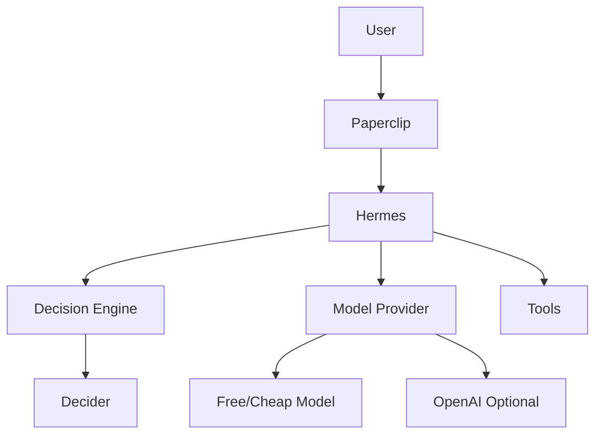

# Helm Architecture

Self-hosted AI agent platform. Local Docker Compose first; same layout targets a single Hetzner VPS later.

## High-level flow

## Compose services

| Service | Role | Image / build |
|---------|------|---------------|
| `paperclip` | Control plane / agent management | `ghcr.io/paperclipai/paperclip:latest` |
| `hermes` | Agent runtime (gateway mode) | `nousresearch/hermes-agent:latest` |
| `decider` | Typed decision model HTTP API | build `services/decider` |
| `decision-gateway` | `DecisionEngine` adapter | build `services/decision-gateway` |
| `model-router` | `ModelProvider` (stub / OpenAI-compatible) | build `services/model-router` |
| `personal-assistant` | Daily brief orchestration + weather | build `services/personal-assistant` |

Private Docker network: `helm`. Services address each other by DNS name (`http://decider:8000`, `http://hermes:8642`).

## Persistence

| Host path | Container path | Survives `compose down` | Contents |
|-----------|----------------|-------------------------|----------|
| `./data/paperclip` | `/paperclip` | yes | Embedded Postgres, uploads, secrets metadata, agent workspaces |
| `./data/hermes` | `/opt/data` | yes | Hermes `.env`, `config.yaml`, sessions, memories, skills, logs |
| `./data/decider-hf` | `/cache/huggingface` | yes | Hugging Face model weight cache |
| `./data/backups` | (host only) | yes | Tar archives from `scripts/backup.sh` |

### macOS / Docker Desktop note

Hermes uses SQLite (`state.db`) with WAL by default. Bind mounts over virtiofs can corrupt WAL. Prefer a named volume for Hermes on macOS if you see integrity warnings; Linux bind mounts are fine.

## Ports (development)

| Port | Binding | Service |
|------|---------|---------|
| 3100 | host | Paperclip |
| 8642 | `127.0.0.1` | Hermes API |
| 8081 | `127.0.0.1` | Decision gateway |
| 8082 | `127.0.0.1` | Model router |
| 8083 | `127.0.0.1` | Personal assistant |
| 8000 | internal only | Decider |
| 9119 | off by default | Hermes dashboard |

## Coupling rules

- Paperclip talks to Hermes via the built-in `hermes_gateway` adapter (`http://hermes:8642`).
- Orchestration talks to Decider only through `decision-gateway` (`DecisionEngine`).
- Model providers are behind a thin `ModelProvider` interface (Milestone 7+).
- No Docker socket mounts. No host root filesystem mounts.
